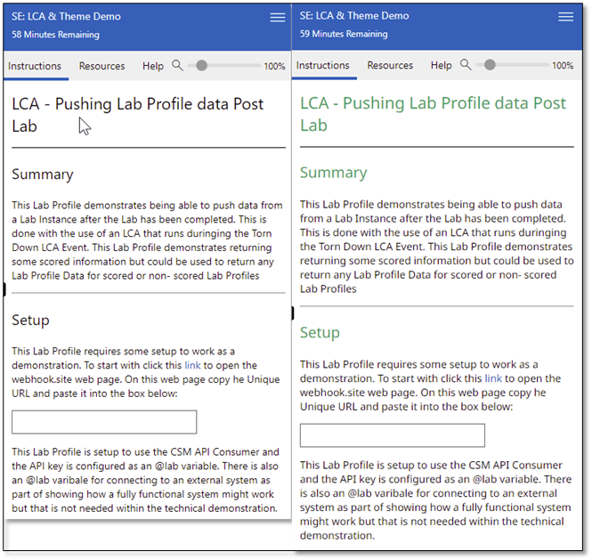
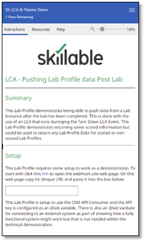

Skillable Studio (formerly LOD) lab delivery platform has for many years been
used by most of our customers as an ‘As Is’ platform. For a long-time, customers
have been able to bring their own identities to make the platform look like it
is an extension of their companies’ resources. We are starting to see an
increase in requests in the use of this feature, so this document discusses a
simple way to start to bring your own identity.

This document will look at two ways to add consistency to the lab instructions
for lab developers using a technology called Themes and leveraging Cascading
Style Sheets, or CSS and some JavaScript. We will look at two branding elements
\- fonts and company logos.

# Bring Your Own Fonts

Many companies are now moving away from the Web Safe fonts and are moving more
towards custom fonts often connected with company Colour schemes. If you want to
bring your own font to Skillable there are several tasks, you need to do before
reaching out to Skillable. These steps include:

1.  Making the font ‘Web Ready’. This might already be done if using a public
    font or you are already using it on your website. This web page talks about
    different font format options
    (<https://www.w3schools.com/css/css3_fonts.asp>) I personally always pick
    WOFF2 as it is supported by all modern browsers and is the latest version of
    the WOFF format and is the W3C recommendation. If your font is not web ready
    you can use one of the convertors on the Internet.

2.  If using your own font, it needs to be stored on a publicly accessible store
    so a user’s browser can download it, (Azure Storage Account or AWS S3 Bucket
    would be examples). If it is a public font e.g., a Google font you can
    normally link to it directly.

## Private font

Once these steps are complete you are now ready to build your Theme. The Theme
will need at least two sections: an @font-face section to reference the font
location; and then a section detailing which parts of a web page you would like
to be updated with the new font(s). In the example below the Theme imports the
Noto Sans Regular and the Noto Sans Bold fonts. The regular is used for
paragraph text and the bold is used for heading text. All the content is placed
into the Instruction CSS page of a Theme. Notice in this case a second font has
been specified Sans Serif which is one of the Web Safe fonts in case there is a
loading issue.

> @font-face {    
>       font-family: notosansbold;    
>       src: url('https://skillableresources.blob.core.windows.net/theme/fonts/notosans-bold-webfont.woff2') format('woff2');     
> }    
>     
> h1, h2, h3, h4, h5, h6 {    
>     font-family: notosansbold, sans-serif;    
>         color: #3F9B65    
> }    
>    
> @font-face {    
>     font-family: notosansregular;     
>     src: url('https://skillableresources.blob.core.windows.net/theme/fonts/notosans-regular-webfont.woff2') format('woff2');     
> }    
> p {    
>     font-family: notosansregular, sans-serif;    
> }    

## Public font

If the font was a public font and you did not need to host the font yourself,
for example a public Google font which the above font is, the same results can
be achieve just by creating the Theme to load the font straight from Google. The
easiest way would be to use both the Instruction CSS and Instruction Script
sections of a Theme. Google fonts can combine multiple fonts into a single
document using JavaScript, from the Google Fonts web page the URL can be
retrieved for downloading the fonts from. In the Instruction CSS content it now
just lists the parts of a webpage to have the font replaced, so as before
Headings and the paragraph font.

> h1, h2, h3, h4, h5, h6 {     
>     font-family: noto sans, sans-serif;    
>         color: #3F9B65     
> }     
> p {     
>     font-family: noto sans, sans-serif;     
> }     

The Instruction Script section would contain one line with the link retrieved
from Google Fonts.

> $('head').append('\<link rel="stylesheet" href="https://fonts.googleapis.com/css2?family=Noto+Sans:wght@400;700&display=swap" type="text/css" /\>');

This single line tells the Skillable lab client to append this content to the
webpage header and embed a link, that link will contain content from Google that
will enable the fonts to be downloaded. If you follow the link above it will
tell us the font family name to use for the Instruction CSS part of the file,
hence the name for the font-family has changed to ‘Noto Sans’.

Below is a before (left) and after (right) example, with before using the
default fonts in Skillable:

# Bring Your Own Logo

To bring your own logo it can be just added to a set of lab instructions and be
referenced using the **!IMAGE** markdown command. However, that requires
everyone to have the logo, and often you find content developers might use logos
that are not of sufficient quality, or even forget to add the logo as too much
work is involved. In addition, if a company changes its logo, it will
potentially become a massive work effort to change the logo in every location in
every Lab Profile. Whereas storing the logo externally it becomes much easier to
for it to be included in the instructions, updated as required, etc.

The high-level steps to complete this are:

1.  Store the logo jpg file so that it is centrally accessible.

2.  Update the Theme

3.  Inform the instructor how to call the logo in the instructions

Having stored the logo or logos what changes are required to the theme?
Generally, the Theme would require two entries per logo, one that defines where
to retrieve the logo from, and the second to configure properties of the logo
for example size and placement. Looking at the example below you can see the
following:

**.instructions .logo-company** defines the file location and the name
(.logo-company) used in the markdown to refer to the logo. The **.instructions
div** defines the property values for the logo. One key trick here is the
**class\*=”logo-“** this ensures all the setting are applied to all objects that
are called **logo\*** this allows the same settings to be applied to multi
images if required. Multiple sections can be created if defining different
values for different images is required.

> .instructions .logo-company {     
>     background-image: url(https://skillableresources.blob.core.windows.net/theme/fonts/Skillable-Logo-color.jpg);     
> }    
>     
> .instructions div[class*="logo-"] {    
>     margin: 0 auto;    
>     max-width: 50%;    
>     min-height:100px;    
>     background-size: contain;    
>     background-position: center;    
>     background-repeat: no-repeat;    
> }    

To then use this logo in the instructions the lab author just uses the logo’s
name in the following format:

> :::logo-company     
> :::    

Wherever that text appears the logo will be displayed in the instructions. By
combining all the information into a single Theme, the final result is:

One last point: Themes can be applied not just at the Lab Profile level (e.g.,
use an Organisation Template Gallery item to create profiles with the Theme
already attached), but also at the Lab Series Level, the Organisation Level, as
well as being able to be set using Consumption rules. Therefore, these settings
can be applied without having to ensure a content author remembers to add the
Theme.
